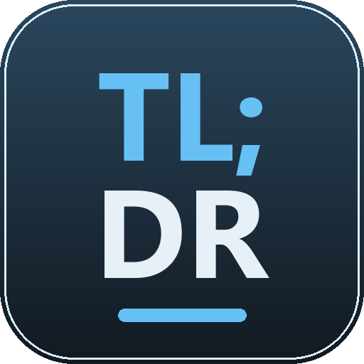
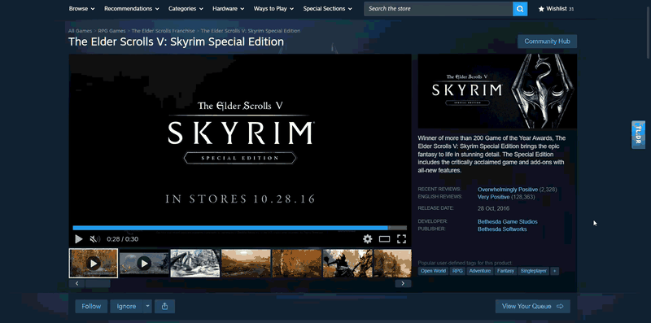
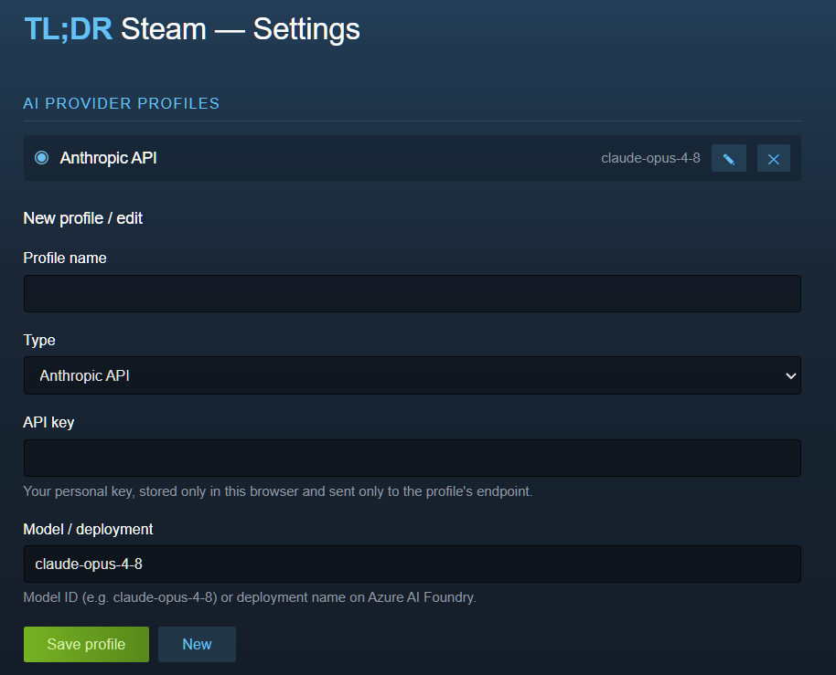
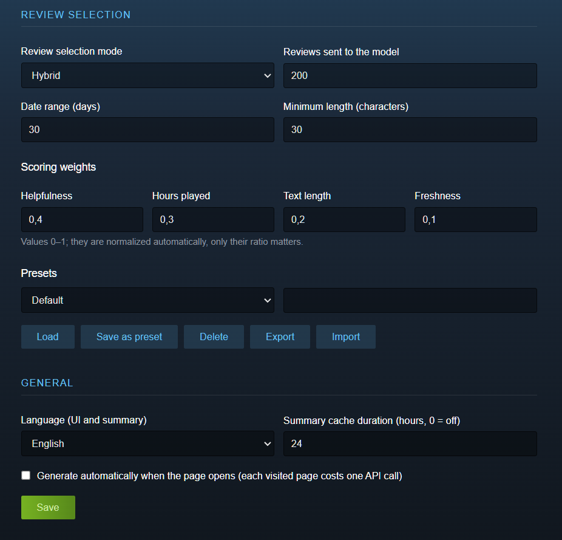

# Steam TL;DR

[](https://github.com/luca-vullo/steam-tldr/actions/workflows/ci.yml)
[](https://github.com/luca-vullo/steam-tldr/releases)
[](LICENSE)

**The problem**: a Steam page tells you a game is "Very Positive". It doesn't tell you *why*, what players actually complain about, or whether things changed after the last patch.

**The solution**: one click for an AI summary of the most recent and most helpful reviews, right on the store page — a one-line verdict, sentiment, recurring strengths and weaknesses, and notes about recent patches when reviews mention them.



Bring your own AI: the extension works with **your own API key** on the provider you prefer — Anthropic Claude, Claude deployed on Azure AI Foundry, OpenAI (official or Azure), Google Gemini, or a local OpenAI-compatible model (Ollama, LM Studio). No account, no backend, no telemetry.

> ⚠️ **Compliance first**: the extension **never posts anything to Steam**. The summary is rendered locally in your browser only. Publishing bot-generated reviews would violate Steam's rules ("Do not artificially influence reviews"). See [docs/SPECS.md](docs/SPECS.md#2-compliance-with-steam-guidelines).

## Screenshots

| Provider profiles | Review selection & presets |
|---|---|
|  |  |

## How it works

1. You visit a `store.steampowered.com/app/{appid}/...` page
2. A "TL;DR" tab appears on the right edge of the page; click it to open the side panel
3. Click **Generate TL;DR**: the service worker fetches recent reviews from Steam's public JSON endpoint (`/appreviews/{appid}?json=1`), selects the most relevant ones with a configurable scoring engine, and sends them to your configured AI provider
4. The structured summary appears in the panel; results are cached locally (24h by default) so revisiting a page is free

## Features

- **Side widget** styled to match the Steam store's dark theme — independent from Steam's page layout, so store redesigns can't break it
- **Multiple provider profiles**: define as many as you want (protocol + endpoint + key + model) and switch the active one; supported protocols:
  - **Anthropic** — Claude API, or Claude deployed on **Azure AI Foundry**
  - **OpenAI-compatible** — official OpenAI, **Azure AI Foundry** (OpenAI v1 endpoint), or **local servers** (Ollama, LM Studio — API key optional)
  - **Google Gemini**
- **Configurable review selection**: hybrid mode (most-helpful within a date range + most recent), pure recent with client-side scoring, or Steam's native ranking; tune review count, date range, minimum length and scoring weights, and save your configurations as **presets** (with JSON export/import)
- **5 languages** for the UI and the generated summary: English, Italian, Spanish, French, German — input reviews are read in *all* languages
- **Local cache** with configurable TTL; "Regenerate" bypasses it
- **Privacy by design**: your API keys live only in `chrome.storage.local` and are sent only to the endpoint of their own profile; review texts are the only data sent to the AI provider; no telemetry, no server of ours

## Install

### From a release (no build tools needed)

1. Download the latest `steam-tldr-vX.Y.Z.zip` from the [Releases page](https://github.com/luca-vullo/steam-tldr/releases)
2. Unzip it anywhere (keep the folder — Chrome loads it from there)
3. Open `chrome://extensions`, enable **Developer mode** (top right)
4. Click **Load unpacked** and select the unzipped folder
5. Open the extension's **Options**, create a provider profile with your API key, and save
6. Visit any Steam game page and click the **TL;DR** tab on the right edge

The zip is built automatically by [CI](.github/workflows/release.yml) from the tagged source — you can reproduce it yourself with the steps below and compare.

### From source

```sh
git clone https://github.com/luca-vullo/steam-tldr.git
cd steam-tldr
npm ci
npm run build
```

Then load the `dist/` folder as an unpacked extension (steps 3–6 above).

## Configuration notes

| Profile type | Endpoint | Model field |
|---|---|---|
| Anthropic API | — (default) | Model ID, e.g. `claude-opus-4-8` |
| Claude — Azure AI Foundry | `https://YOUR-RESOURCE.services.ai.azure.com/anthropic/` | Your deployment name |
| OpenAI | — (default) | Model ID |
| OpenAI — Azure AI Foundry | Your resource's OpenAI v1 endpoint | Your deployment name |
| Google Gemini | — (default) | Model ID |
| Local (OpenAI-compatible) | e.g. `http://localhost:11434/v1` (Ollama) | Local model name (API key optional) |

For custom endpoints (Azure, local) the extension asks for host permission **only for that specific origin** when you save the profile.

## Security & privacy

The extension is designed to be **audited in one sitting** (~1,500 lines of TypeScript): no telemetry, no server of ours, keys stored locally and sent only to their own profile's endpoint, model output always rendered as text. [docs/SECURITY.md](docs/SECURITY.md) contains the full threat model, the data-flow map, the permissions rationale, and a set of invariants you can verify mechanically with `grep`. Found a vulnerability? See [SECURITY.md](SECURITY.md) for private reporting.

## Documentation

- [docs/SPECS.md](docs/SPECS.md) — functional specification, Steam compliance, roadmap
- [docs/ARCHITECTURE.md](docs/ARCHITECTURE.md) — technical architecture, data flows, provider layer
- [docs/SECURITY.md](docs/SECURITY.md) — threat model and audit guide

## How this was built

Most of the code was written with AI assistance (Claude Code), following a **spec-driven workflow**: the [functional spec](docs/SPECS.md), the [architecture](docs/ARCHITECTURE.md) and the [threat model](docs/SECURITY.md) came before the code, every AI-produced change was reviewed and tested end-to-end across five provider setups, and the commit history documents the reasoning behind each decision. That's also why the security doc exposes [mechanically verifiable invariants](docs/SECURITY.md#5-invariants-you-can-verify-mechanically): you don't have to trust the author — or the AI — you can check.

## Contributing

Issues and pull requests are welcome. Keep in mind the project's hard boundaries: no writes to Steam, no telemetry, no bundled API keys. Please run `npm run build` (typecheck included) before submitting.

## Support the project

Steam TL;DR is free and MIT-licensed, and will stay that way. If it saves you time (or a bad purchase), you can support development on Ko-fi:

[](https://ko-fi.com/lucafuncoder)

## License

[MIT](LICENSE) © Luca Vullo

Not affiliated with Valve Corporation. Steam is a trademark of Valve Corporation. AI-generated summaries may contain mistakes — always check the actual reviews for important decisions.
